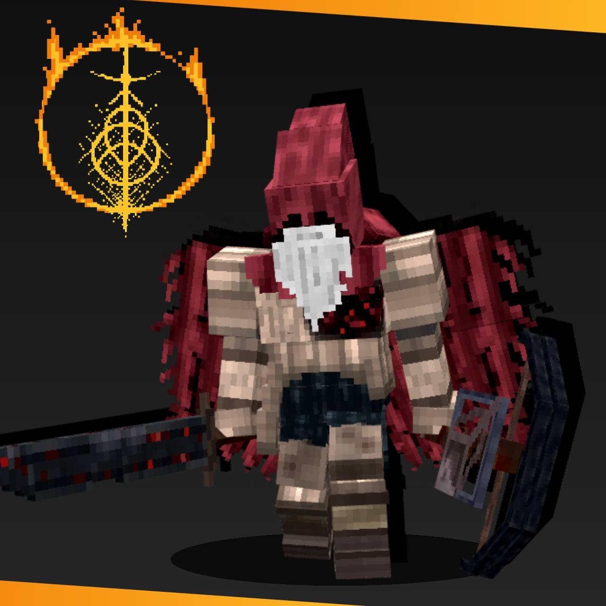
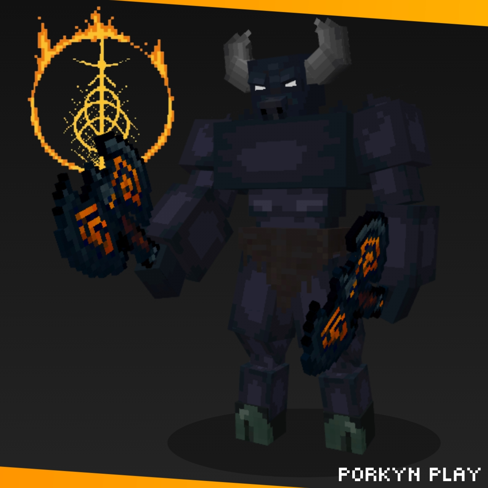
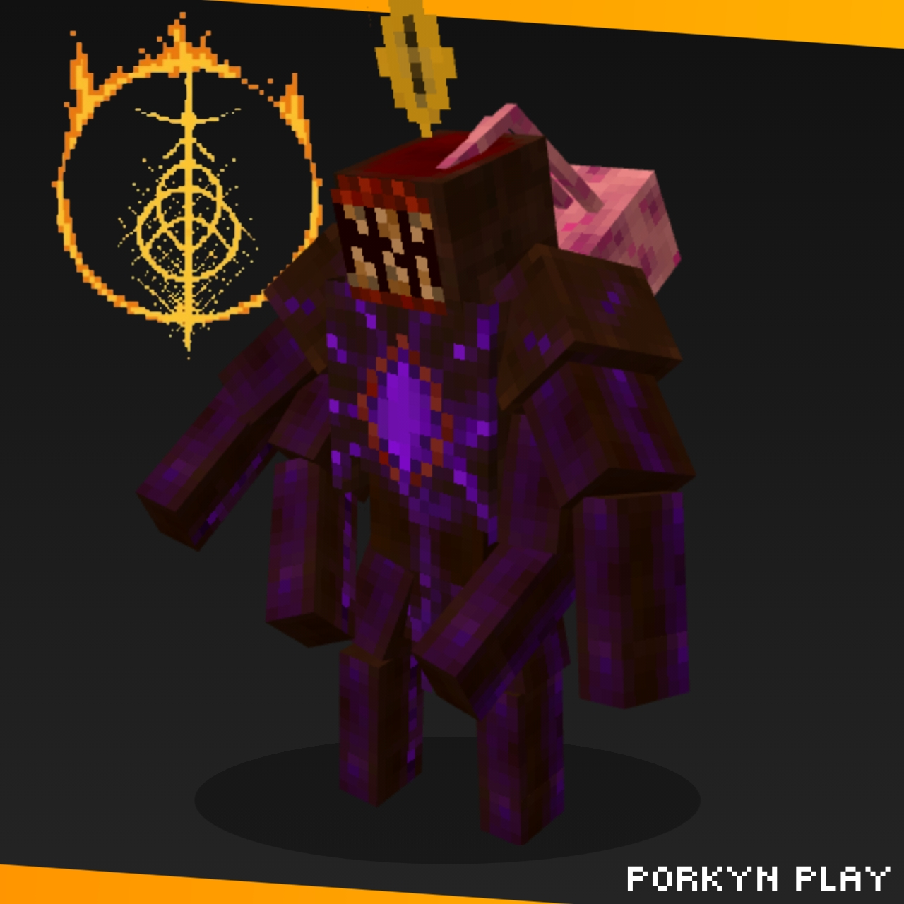
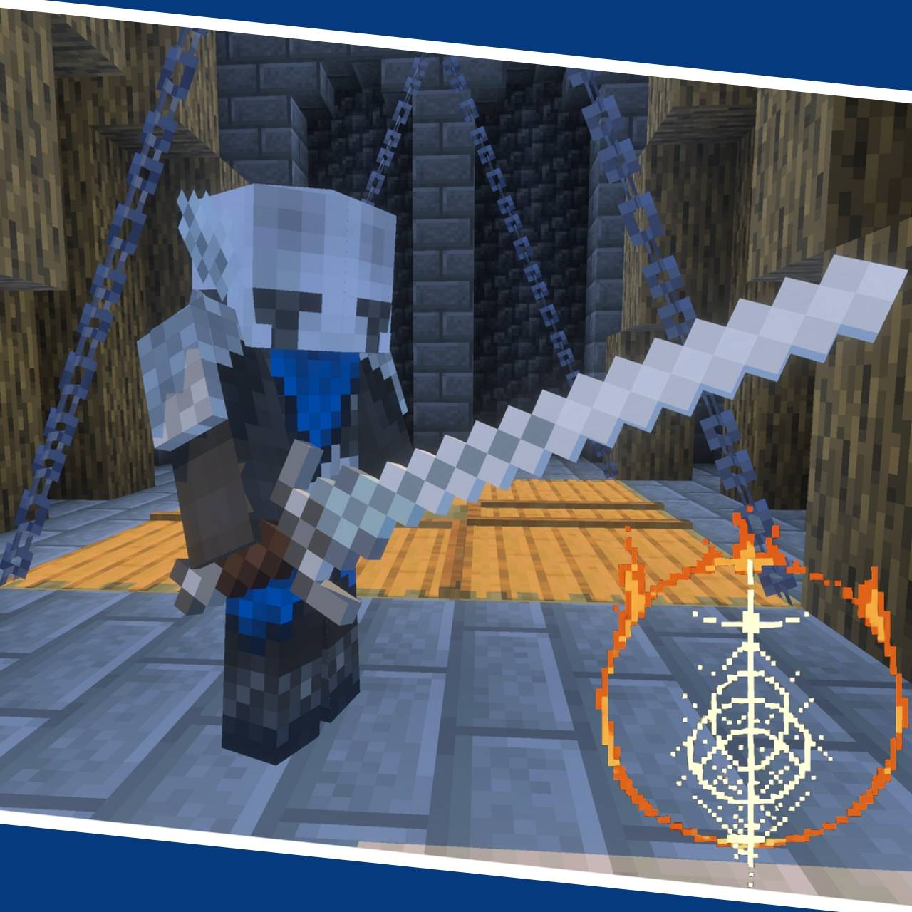
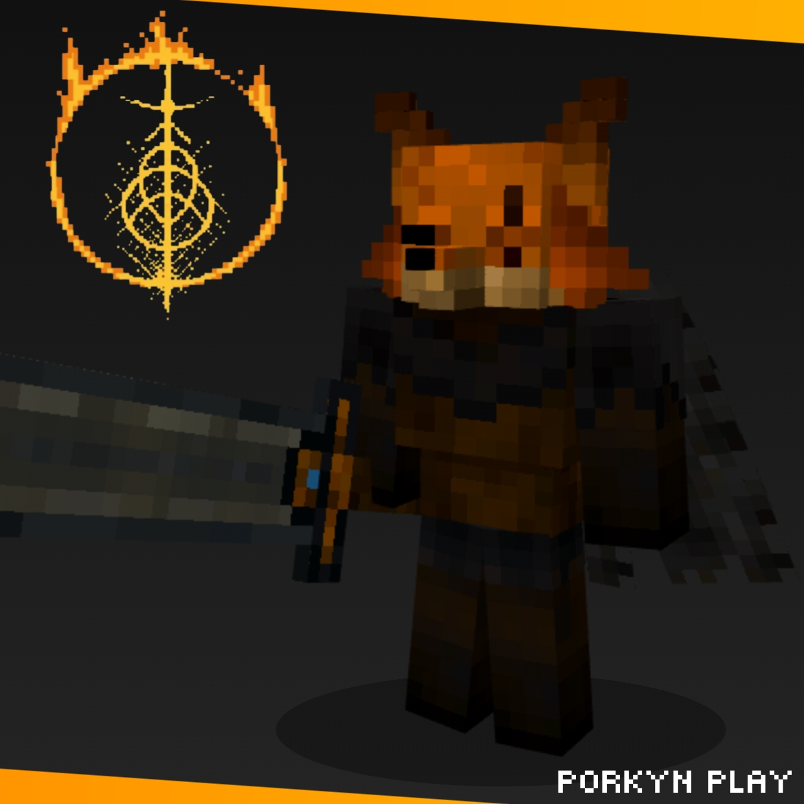
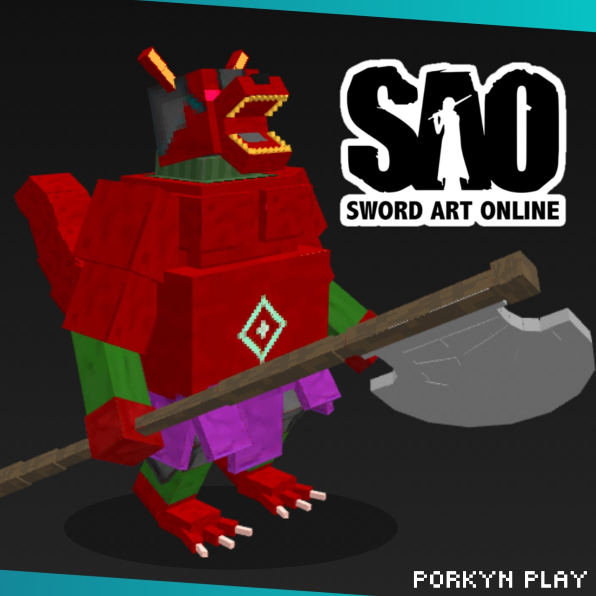
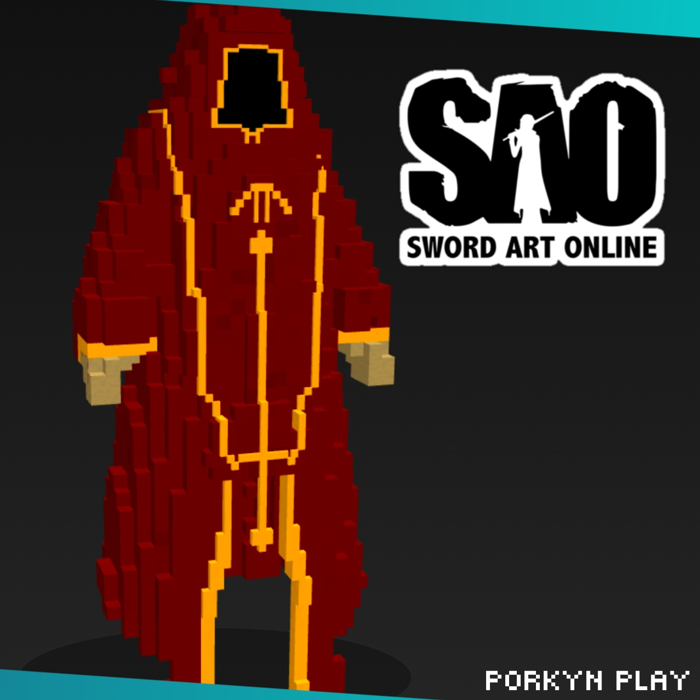

# 🎨 Minha Galeria de Modelos 3D

Bem-vindo ao meu portfólio! Aqui estão alguns dos modelos que criei para meus mods de Minecraft e outros projetos.

---

## 1. Slave Knight Gael
*Boss icônico de Dark Souls III, recriado no estilo de modelagem low-poly voxel.*

*   **Software:** Blockbench.
*   **Projeto Vinculado:** [SoulsCraft](LINK-PARA-O-REPOSITORIO-DO-MOD)

---

## 2. Minotaur
*Minotauro da mitologia grega, recriado no estilo de modelagem low-poly voxel.*

*   **Software:** Blockbench
*   **Projeto Vinculado:** [SoulsCraft](LINK-PARA-O-REPOSITORIO-DO-OUTRO-MOD)

---

## 3. Breathtaker
*Boss original, criado no estilo de modelagem low-poly voxel.*

*   **Software:** Blockbench
*   **Projeto Vinculado:** [SoulsCraft](LINK-PARA-O-REPOSITORIO-DO-OUTRO-MOD)

---

## 4. Knight of Duskblue
*Personagem inspirado no Selvagem de Elden Ring Nightreign com claymore, no estilo de modelagem low-poly voxel.*

*   **Software:** Blockbench
*   **Projeto Vinculado:** [SoulsCraft](LINK-PARA-O-REPOSITORIO-DO-OUTRO-MOD)

---

## 5. Renart
*Renart, personagem original, criado no estilo de modelagem low-poly voxel.*

*   **Software:** Blockbench
*   **Projeto Vinculado:** [SoulsCraft](LINK-PARA-O-REPOSITORIO-DO-OUTRO-MOD)

---

## 6. lllfang the Kolbold Lord
*Illfang the Kobold Lord, boss de Sword Art Online, recriado no estilo de modelagem low-poly voxel.*

*   **Software:** Blockbench
*   **Projeto Vinculado:** [SwordArtCraft](LINK-PARA-O-REPOSITORIO-DO-OUTRO-MOD)

---

## 7. Akihiko Kayaba
*Personagem de Sword Art Online, recriado no estilo de modelagem low-poly voxel.*

*   **Software:** Blockbench
*   **Projeto Vinculado:** [SwordArtCraft](LINK-PARA-O-REPOSITORIO-DO-OUTRO-MOD)

---
